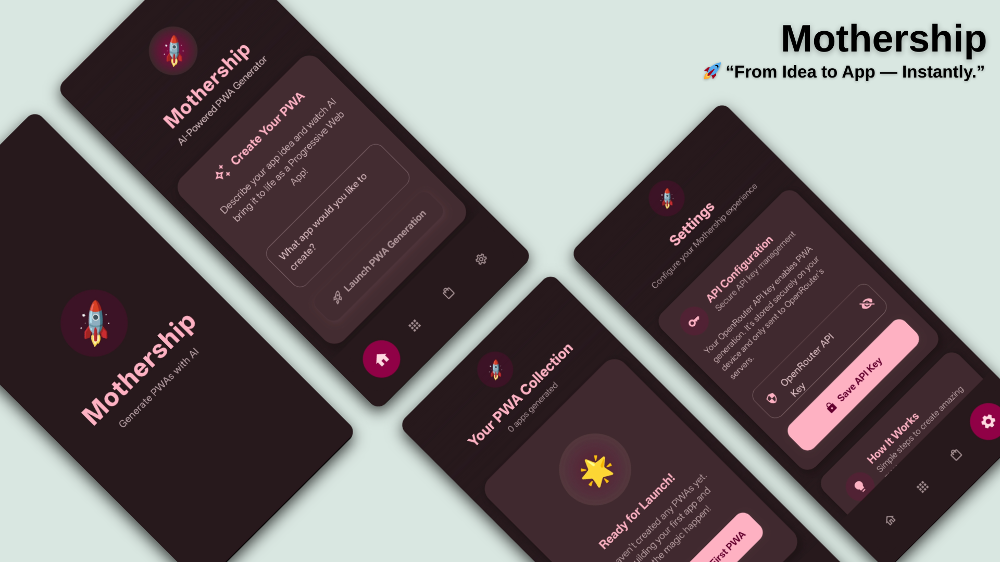

# Mothership

**Mothership** is an AI-powered Android app that lets you create, install, and manage Progressive Web Apps (PWAs) using natural language. Describe your app idea, and Mothership uses advanced Large Language Models (LLMs) to generate a complete, installable PWA for you—no coding required.

## Key Features

- **AI PWA Generation:** Describe your app in plain English and generate a ready-to-use PWA (HTML, manifest, service worker, JS, CSS).
- **Native Android Shell:** Run your PWAs in a native Android environment for a seamless app-like experience.
- **PWA Management:** Browse, launch, and delete your generated or installed PWAs from within the app.
- **Install from URL:** Add existing PWAs by providing their URL.
- **Modern UI:** Built with Jetpack Compose for a smooth, modern user experience.
- **Notifications:** Get notified when your PWA generation is complete.

## How It Works

1. **Describe Your App:** Enter a description (e.g., “A weather dashboard with dark mode”).
2. **AI Generation:** Mothership sends your prompt to an LLM, which returns a complete PWA code bundle.
3. **Install & Launch:** The app packages the PWA and lets you launch it as a native-like app on your device.
4. **Manage Apps:** View, launch, or remove your PWAs anytime.

## Screenshots



## Getting Started

### Prerequisites

- Android Studio (or command-line tools)
- API key for the OpenRouter LLM service (set in app settings)
- Android device or emulator (API 24+)

### Building the App

#### Release Build (Signed APK)

1. **Clone the repository:**
   ```bash
   git clone <repository-url>
   cd app2.0
   ```

2. **Set up signing:**
   - Create a `signing.properties` file in the project root:
     ```
     export KEYSTORE_PATH=<path to your keystore>
     export KEYSTORE_PASSWORD=<your keystore password>
     export KEY_ALIAS=<your key alias>
     export KEY_PASSWORD=<your key password>
     ```
   - Generate a keystore if needed:
     ```bash
     keytool -genkey -v -keystore <keystore-name>.jks -keyalg RSA -keysize 2048 -validity 10000 -alias <your-alias>
     ```

3. **Build the signed APK:**
   ```bash
   ./release.sh
   ```
   The APK will be at `app/build/outputs/apk/release/app-release.apk`.

#### Debug Build

To build a debug APK (no signing required):
```bash
./gradlew assembleDebug
```
Find the APK at `app/build/outputs/apk/debug/app-debug.apk`.

## Usage

1. **Launch Mothership on your device.**
2. **Enter your OpenRouter API key** in the Settings screen.
3. **Describe your app idea** and tap “Launch PWA Generation.”
4. **Wait for the notification**—your PWA will appear in your app list.
5. **Launch, manage, or delete** your PWAs anytime.

## Tech Stack

- **Kotlin**, **Jetpack Compose** (UI)
- **Retrofit** (API calls)
- **Android Service & Notifications**
- **OpenRouter LLM API** (PWA code generation)

## Contributing

Pull requests are welcome! For major changes, please open an issue first to discuss what you’d like to change.

## License

This project is licensed under the MIT License. See the [LICENSE](LICENSE) file for details.